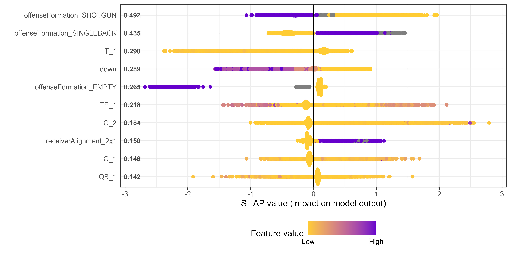
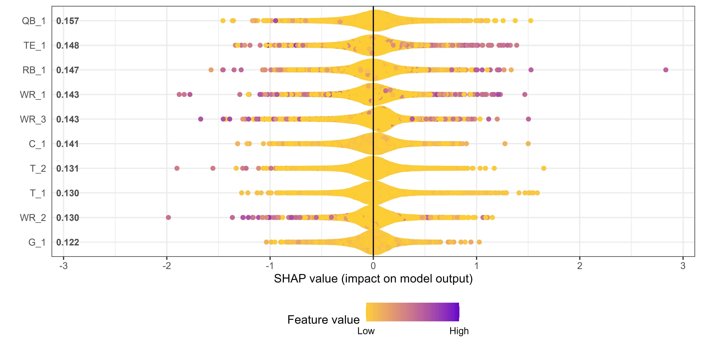

What We Know Before They Go: Using Motion Data to Predict NFL Plays
================

## Introduction

In the NFL teams are given 40 seconds in between plays to prepare for
the next one. Included in this time are substitutions, play-calls, and a
combination of post-huddle movements that all result in what happens on
the next down. Offensive decisions such as lineman alignment, receiver
positioning, and motion give clues to the defense on what they may do
after the ball is snapped. From a defensive perspective, players must be
ready for whatever could come next, shifting, and readjusting as the
offense moves to confuse them. Just like a head coach or offensive
coordinator speaks to their quarterback to give plays through an
earpiece, a similar practice happens in the helmet of one defensive
player. The motivation for this project is to figure out what is likely
to happen in the following play based on pre-snap motion so that
defensive coordinators can enable their playmakers to be ready.  
Using various machine learning techniques, this project will result in
two sets of outcomes. The first is a run-pass predictor, where the
techniques will be applied to see if there are signals as to what the
play call will be when the ball is snapped. The second is an analysis of
Expected Points Added based on pre-snap motion, showing how this motion
can increase the effectiveness of a play. More explosive plays result in
a higher expected point value, for which is something that defensive
coaches need their playmakers to be ready. The final takeaway of this
project will be signals to look out for when the offense breaks their
huddle and gets set, as well as what we can tell based on offensive
players taking motion before the snap.

## Related Work

The NFL conducts the Big Data Bowl every year with the goal of finding
out new things that can be done with football statistics. Past winners
of the competition include identifying route combinations that gain
yardage more often, variables that lead to success during a run play,
and developing a statistic that tracks tackle probability.

## Data Description

While there is a lot of data given to work on this problem, only some of
the datasets provided by the NFL will be used for the purposes of this
project. The first of these is the “play” data, which contains details
on everything that happened during every play of every game for the
whole season. Variables included are the down and yardage to go, current
game score, expected points, offensive and defensive formation, and the
result of the play. Another dataset used is the “player play” data. This
dataset has details about what every individual player on the field is
doing during a certain play. This data and the motion variables
inMotionAtBallSnap and motionSinceLineset are keys to deciphering my
problem. Finally, there is week-by-week tracking data that will be used
for visualization to aid my findings. It can be used to animate plays to
better understand how motion can key a defense in on what the offense
plans to do.   The tracking dataset was used to create the motion
variable. This variable tracks the distance between where the player was
when the line gets set and where they are when the ball is snapped.
Distance was calculated as Euclidian distance, which is found using the
Pythagoras theorem. Since a player’s position is collected as x and y
pairs, this measure of distance calculates the length of the line that
connects the initial pair and the second pair. This variable will be
especially important in my EPA analysis, where models will be run to
determine what kinds of movement contribute to larger plays.

## Methods

To improve predictive performance, the Random Forest model was used.
Each time, the first model that ran was a bagging model. The bagging
model improves the performance of the single decision tree while giving
me a baseline to tune off. Random Forest models are useful because they
are not prone to overfitting and block out noise well. They are less
interpretable than the basic tree, but this trade-off was worth it for
this project. These were the hardest models for the computer to run,
however, as they are computationally intensive.   The final model ran
in every scenario was XGBoost. XGBoost models may take a little more
preparation to get up and running, but they were the right choice for
the questions being asked. These models are known for their high
predictive performance, and they lived up to that during this project.
While using Machine Learning techniques, the importance of interpretable
results cannot be understated. The results of my models would mean
nothing if they did not have this interpretability as well as someone
that knew how to interpret them. XGBoost models use Shapley values to
show the average marginal contribution of a feature value across all
possible coalitions. The higher a Shapley value is, the more significant
of an impact the feature has on the model’s prediction.

## Results

First, the Run vs. Pass problem. For all the models ran for this
problem, the predictability was judged based on accuracy compared to the
test data. When it came to running the Random Forest model, the same
process was utilized each time. First, a bagging model would be run. A
tuning process was used to test different parameters, and then the
Random Forest was rerun for the best combination. For both the model
with no movement and the one with movement, accuracy was similar. This
showed that movement variables do not have as much importance to whether
an offense is going to run or pass. Next was the XGBoost model, where
the hardest part was setting up the data in matrix format. This required
the use of FastDummies for the data to fit into the correct format. The
objective in this model was logistic with evaluation metrics of AUC and
Error. To find the best fitting model max depth, min child weight,
gamma, subsample, colsample, and ETA were tuned.   In terms of
technical execution, the process was similar for the EPA analysis. For
this problem, the Random Forest model was not worth putting too much
time into due to how hard it would be to accurately predict EPA. Due to
this, most of the time spent on this problem was used tuning and
refitting XGBoost models. The main difference here is that instead of
maximizing based on a binary objective, the model’s objective was
minimizing squared error. The evaluation metric was Root Mean Squared
Error and the goal was to minimize it through this model. Similarly to
the Run vs. Pass, all this time spent tuning an XGBoost model was worth
it for the SHAP graph.

## Discussion

The overarching goal of this project was to develop a set of rules that
could be given to defensive playmakers to enable them to make
assumptions about the type of play the offense was going to run. This
was why the SHAP importance graphs were the most important output of my
code.   First, for the Run vs. Pass:

- Shotgun and Empty sets heavily influence the play call being a pass.
  This is due to the Running Back not being able to gain momentum with
  the football before coming in contact with a defender.

- Having more than three receivers on the field means that a pass is
  most likely coming. This data did not breakdown exactly where the
  receivers are lined up, but an alignment of 3x1 and 3x2 are likely to
  be passes compared to 2x1.

- The further in to the game it is, the more likely an offense is to
  call a run. This is likely due to leading teams calling runs in order
  to run the clock. So this may not be as situationally applicable as
  the other rules.   Next, for EPA:
  

- Higher values of quarter and down are more likely to result in a play
  with lower EPA. Teams may have erratic play calling with less
  opportunities, or they are running out the clock.

- TE movement can be a mixed bag in terms of play outcome. High values
  of TE movement end up on either side of the center in the SHAP graph,
  so stay alert and be ready to make a play when the TE makes
  significant movement.

- WR2 movement is not good for the offense. High values of WR2 movement
  end up almost strictly on the left half of center, meaning that they
  are not good for EPA. Offenses give themselves a much better chance
  when they let their more dynamic WR1 make the movement.

- Offenses lining up in Empty are looking to make a big play. Be ready
  for a pass that is looking to leave you behind.

## Conculsion and Future Work

NFL offenses are designed to trick you. Because of this, NFL defenses
must be aware of any hints that are given to them by the offense. This
project was designed to empower these defensive players with a little
extra knowledge on what offenses are planning to do. With extra time,
there is a lot that can be done with this project. The easiest thing
that I would love to incorporate is the speed and acceleration of each
player at the time that the ball is snap. It would be interesting to
perform an analysis on plays where a player is actively in motion at the
time of the snap and what can happen after. I plan to go deeper into
this problem and clean up my results.
